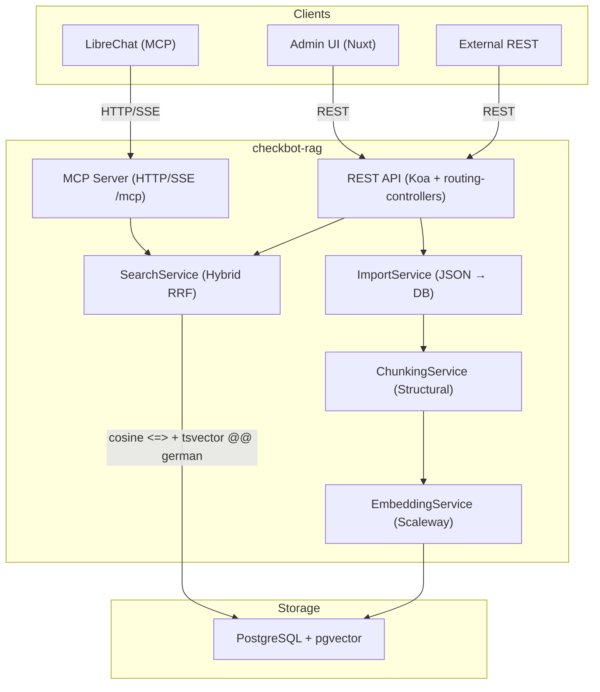

# Checkbot RAG

Fact-check RAG service for Faktenforum. Hybrid semantic + full-text search over fact-checks, exposed as REST API, MCP server (for LibreChat), and Nuxt admin UI.

## Running standalone

You can run and test Checkbot RAG without the full LibreChat stack:

1. **Environment:** Copy `.env.example` to `.env`. Set:
   - `CHECKBOT_RAG_EMBEDDING_API_KEY` — your Scaleway API key (required to run)
   - `CHECKBOT_RAG_POSTGRES_PASSWORD` — DB password (required to run)
   - `CHECKBOT_RAG_MCP_API_KEY` — optional; if set, MCP requests require `Authorization: Bearer <key>`
   All other variables have defaults.

2. **Start:** From the repo root run:
   ```bash
   docker compose up --build -D
   ```
   Admin UI: http://localhost:3020. Place claim JSON dumps in `./exports/` and trigger import via the UI or `/api/v1/import`.

Checkbot runs as a **separate** stack or standalone. Consumers (e.g. LibreChat) connect via the MCP URL and, when configured, an API key.

### Docker image build (CI)

Images are built and pushed by this repo's GitHub Actions workflow (`.github/workflows/build-checkbot-rag.yml`) on push. Consumers run the image in their own stack or pull from `ghcr.io/faktenforum/checkbot-rag`. Ensure the GitHub package has **Manage Actions access** for this repository so `GITHUB_TOKEN` can push.

## Architecture



## Tech Stack

| Layer | Technology |
|-------|-----------|
| Runtime | Bun (TypeScript, no compile step) |
| HTTP framework | Koa + routing-controllers + class-validator |
| MCP | @modelcontextprotocol/sdk, HTTP/SSE transport |
| Database | PostgreSQL + pgvector |
| Embedding | Scaleway Qwen3-Embedding-8B (OpenAI-compatible) |
| Search | pgvector cosine + PostgreSQL FTS (`german`) + RRF |
| Frontend | Nuxt, Nuxt UI, Tailwind, TanStack Vue Query |

## Chunking Strategy

Each fact-check produces two types of chunks:

| Type | Content | Tokens |
|------|---------|--------|
| `claim_overview` | synopsis + ratingSummary + ratingStatement + ratingLabel + categories | ~200–500 |
| `fact_detail` | individual fact.text + source excerpts | ~300–1500 |

Long facts exceeding `CHECKBOT_RAG_MAX_CHUNK_CHARS` are split at sentence boundaries with ~20% overlap to preserve context.

Each chunk carries metadata: `claimId`, `shortId`, `chunkType`, `factIndex`, `ratingLabel`, `categories`, `publishingDate`, `publishingUrl`, `status`.

## Hybrid Search (RRF)

Two search methods are combined using Reciprocal Rank Fusion:

1. **Vector search** — pgvector cosine distance on Qwen3 embeddings (semantic matching)
2. **Full-text search** — PostgreSQL `tsvector` with `german` dictionary, `ts_rank_cd` scoring (exact/stemmed keyword matching)

**RRF formula:**
```
score(doc) = weight_vec / (k + rank_vec) + weight_fts / (k + rank_fts)
```

Default: `k=60`, both weights `1.0`. Configure via env vars. Documents appearing in both lists score highest.

**Why both?** Vector search finds semantically related claims ("Klingbeil tritt zurück" finds "Vizekanzler legt Amt nieder"). FTS finds exact names and rare terms ("Klingbeil", "§218"). Together they outperform either alone.

## Environment Variables

| Variable | Default | Description |
|----------|---------|-------------|
| `CHECKBOT_RAG_PORT` | `3020` | HTTP port |
| `CHECKBOT_RAG_POSTGRES_HOST` | `checkbot-rag-db` | PostgreSQL host |
| `CHECKBOT_RAG_POSTGRES_PORT` | `5432` | PostgreSQL port |
| `CHECKBOT_RAG_POSTGRES_DB` | `checkbot_rag` | Database name |
| `CHECKBOT_RAG_POSTGRES_USER` | `checkbot_rag` | DB user |
| `CHECKBOT_RAG_POSTGRES_PASSWORD` | — | DB password (required to run) |
| `CHECKBOT_RAG_EMBEDDING_PROVIDER` | `scaleway` | `scaleway` / `openrouter` / `openai` |
| `CHECKBOT_RAG_EMBEDDING_MODEL` | `qwen3-embedding-8b` | Model name |
| `CHECKBOT_RAG_EMBEDDING_API_KEY` | — | API key (required to run) |
| `CHECKBOT_RAG_EMBEDDING_DIMENSIONS` | `4096` | Matryoshka dims: 4096 / 2048 / 1024 / 512 |
| `CHECKBOT_RAG_EMBEDDING_BATCH_SIZE` | `32` | Texts per embedding API call |
| `CHECKBOT_RAG_SEARCH_WEIGHT_VEC` | `1.0` | RRF weight for vector search |
| `CHECKBOT_RAG_SEARCH_WEIGHT_FTS` | `1.0` | RRF weight for full-text search |
| `CHECKBOT_RAG_RRF_K` | `60` | RRF constant k |
| `CHECKBOT_RAG_SEARCH_OVERFETCH` | `3` | Fetch `limit × overfetch` candidates before RRF |
| `CHECKBOT_RAG_MAX_CHUNK_CHARS` | `6000` | Max characters per chunk before sentence-splitting |
| `CHECKBOT_RAG_STATIC_DIR` | `/app/public` | Path to Nuxt static files |
| `CHECKBOT_RAG_MCP_API_KEY` | — | Optional. If set, MCP requests must send `Authorization: Bearer <key>` |

## REST API

| Method | Path | Description |
|--------|------|-------------|
| `GET` | `/health` | Health check (includes DB ping) |
| `POST` | `/api/v1/search` | Hybrid fact-check search |
| `GET` | `/api/v1/claims` | List claims (pagination, filters) |
| `GET` | `/api/v1/claims/:id` | Get claim by UUID or short_id (includes chunks) |
| `POST` | `/api/v1/import` | Trigger import from container file path |
| `GET` | `/api/v1/import/jobs` | List import jobs |
| `GET` | `/api/v1/import/jobs/:jobId` | Get import job status |
| `GET` | `/api/v1/stats` | Index statistics |
| `GET` | `/api/v1/categories` | Available categories with counts |
| `GET` | `/api/v1/rating-labels` | Available rating labels with counts |

**Search request:**
```json
{
  "query": "Klingbeil Rücktritt",
  "limit": 10,
  "categories": ["politics"],
  "ratingLabel": "false",
  "chunkType": "all"
}
```

**Import request:**
```json
{ "filePath": "/data/exports/claims_dump.json" }
```

Mount exports: `./exports:/data/exports:ro` in docker-compose.

## MCP Tools

Endpoint: `http://checkbot-rag:3020/mcp` (HTTP/SSE, stateful sessions via `mcp-session-id` header)

| Tool | Parameters | Description |
|------|-----------|-------------|
| `search_factchecks` | `query`, `limit?`, `categories?`, `rating_label?` | Hybrid search, returns formatted Markdown |
| `get_factcheck` | `id` | Full claim by UUID or short_id |
| `list_categories` | — | Categories with counts |

## Sync Architecture (Future)

Import is currently one-shot (JSON file → DB). Planned BullMQ sync pipeline:

```
faktenforum GraphQL subscription
  → BullMQ job queue (Redis)
    → ImportService.importClaim()
      → ChunkingService → EmbeddingService → PostgreSQL
```

The `external_id` and `version_hash` columns are designed for this: only claims with changed hashes are re-embedded.

## Dimension Scaling Reference

| Claims | Chunks (~5/claim) | Memory at 4096 dims | Memory at 1024 dims |
|--------|-------------------|---------------------|---------------------|
| 1,000 | 5,000 | ~320 MB | ~80 MB |
| 10,000 | 50,000 | ~3.2 GB | ~800 MB |
| 100,000 | 500,000 | ~32 GB | ~8 GB |
| 500,000 | 2.5M | ~160 GB ⚠️ | ~40 GB |

Reduce `CHECKBOT_RAG_EMBEDDING_DIMENSIONS` to `1024` (then re-import) if approaching 100k+ claims. Quality impact is minimal for German-language retrieval tasks.

## Future Optimizations

### Search Quality
- **BM25 via ParadeDB** — replace `ts_rank_cd` with true BM25 scoring (IDF + document length normalization). Requires `pg_search` extension. Improves recall for rare German proper nouns and compound words. No RRF code changes needed; only the FTS score source changes.
- **Cross-encoder re-ranking** — after RRF retrieval, apply a German-tuned cross-encoder (e.g. `cross-encoder/ms-marco-MiniLM-L-12-v2` or `deepset/gbert-large-cross-encoder`) to re-rank top-N results. Significant quality gain; adds ~100ms latency.
- **Query expansion for German compound words** — "Klingbeilrücktritt" → ["Klingbeil", "Rücktritt"] pre-processing improves FTS recall for compound nouns.
- **Semantic chunking for long facts** — replace sentence-boundary split with embedding-similarity-based splitting for facts > 3000 chars. Better semantic coherence per chunk.
- **Hybrid retrieval weights tuning** — A/B test `searchWeightVec` vs `searchWeightFts` on a labeled eval set of Faktenforum queries.

### Infrastructure
- **BullMQ sync pipeline** — replace polling-based import with event-driven sync via faktenforum GraphQL subscriptions → Redis → BullMQ workers.
- **Matryoshka dimension reduction** — configure `CHECKBOT_RAG_EMBEDDING_DIMENSIONS=1024` for production at scale (>100k claims). Re-import required after dimension change.
- **HNSW index tuning** — increase `m=32, ef_construction=128` for higher recall at >50k vectors. Costs more memory and indexing time.
- **Read replicas** — for high-traffic search, offload `SELECT` queries to a PostgreSQL read replica while writes go to primary.
