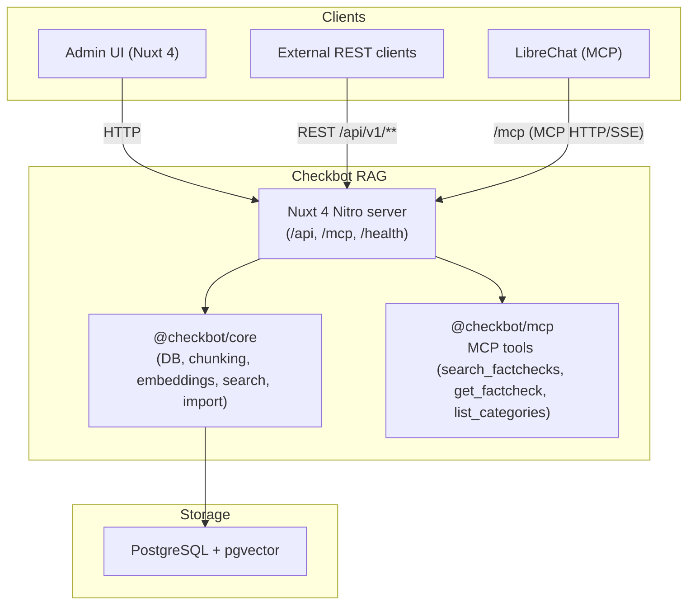

## Checkbot RAG

Fact-check retrieval service for Faktenforum. Hybrid semantic plus full-text search over fact-checks, exposed as REST API, MCP tools, and a Nuxt 4 admin UI.

### Features

- **Hybrid retrieval**: Combines pgvector embeddings and PostgreSQL full-text search with Reciprocal Rank Fusion for high-quality German search.
- **Admin UI**: Nuxt 4 dashboard for searching fact-checks, browsing claims, inspecting chunks, and managing imports.
- **MCP integration**: First-class Model Context Protocol server with tools for search, detail lookup, and category listing.
- **Import pipeline**: JSON dump importer with background jobs, progress tracking, cancellation, and re-import of changed claims only.
- **PostgreSQL + pgvector**: Typed core library for database access, chunking, embeddings, and statistics.

### Packages

This repository is a Bun workspace with three packages:

| Package | Description |
|--------|-------------|
| `core` | Shared TypeScript library with config, database access, chunking, embeddings, search, import, and statistics. See [core/README.md](core/README.md). |
| `frontend` | Nuxt 4 admin UI and Nitro server that exposes `/api/v1/**`, `/health`, and `/mcp`. See [frontend/README.md](frontend/README.md). |
| `mcp` | Reusable MCP server wiring and tools, used by the Nitro route and embeddable in other hosts. See [mcp/README.md](mcp/README.md). |

## Running standalone (Docker)

You can run Checkbot RAG without the full LibreChat stack.

1. **Environment**  
   Copy `.env.example` to `.env` in the repo root. At minimum set:
   - `CHECKBOT_RAG_EMBEDDING_API_KEY` - embedding provider API key
   - `CHECKBOT_RAG_POSTGRES_PASSWORD` - database password
   - `CHECKBOT_RAG_MCP_API_KEY` - optional, required if you want `/mcp` protected by `Authorization: Bearer <key>`

2. **Start services**

   From the repo root:

   ```bash
   docker compose up --build
   ```

3. **Default endpoints**

- **Admin UI**: `http://localhost:3020` (search, claims, import, stats)
- **Health**: `GET http://localhost:3020/health`
- **REST API** (served by Nuxt Nitro, backed by `@checkbot/core`): `/api/v1/search`, `/api/v1/claims`, `/api/v1/import`, `/api/v1/stats`, `/api/v1/categories`, `/api/v1/rating-labels`
- **MCP endpoint**: `POST http://localhost:3020/mcp` (HTTP/SSE, optional `CHECKBOT_RAG_MCP_API_KEY`)

For full request/response shapes, environment variables, and internal search design, see the package READMEs ([core/README.md](core/README.md), [frontend/README.md](frontend/README.md), [mcp/README.md](mcp/README.md)).

## Local development

- **Install dependencies** (from repo root):

  ```bash
  bun install
  ```

- **Type-check all packages**:

  ```bash
  bun run check
  ```

- **Run Nuxt dev server only** (without Docker, PostgreSQL must be reachable):

  ```bash
  cd frontend
  bun run dev
  ```

  By default this listens on `CHECKBOT_RAG_PORT` (or `3020`).

## High-level architecture



The previous standalone backend code was consolidated into the `core`, `frontend`, and `mcp` packages. All HTTP traffic now terminates at the Nuxt Nitro server, which delegates to `@checkbot/core` for data access and search, and to `@checkbot/mcp` for MCP sessions and tools.

